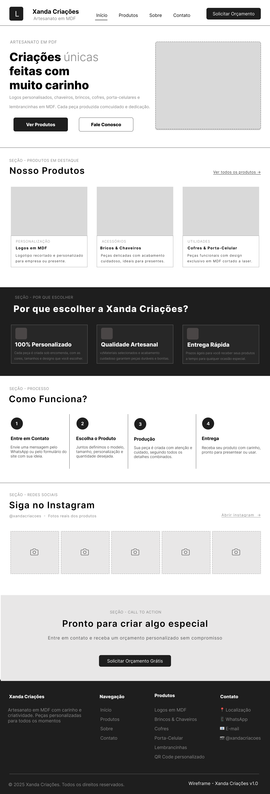
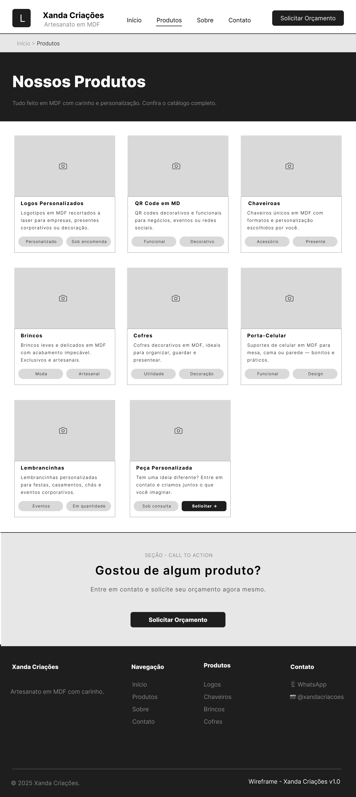
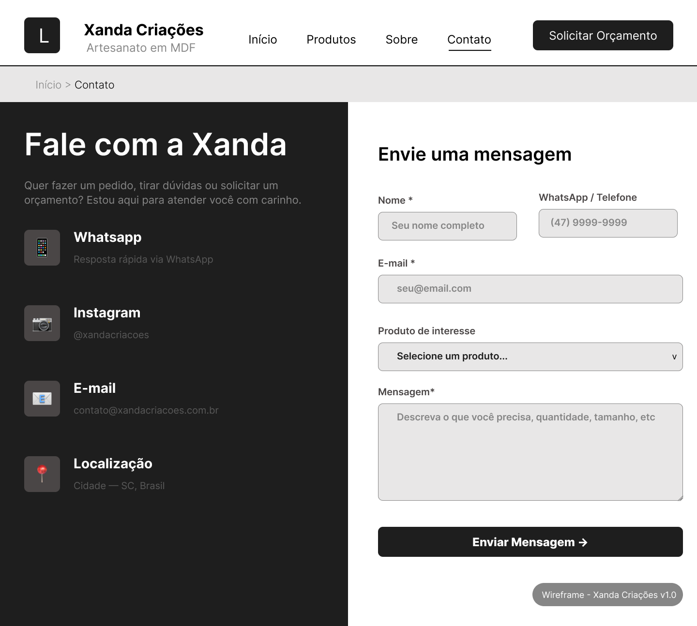
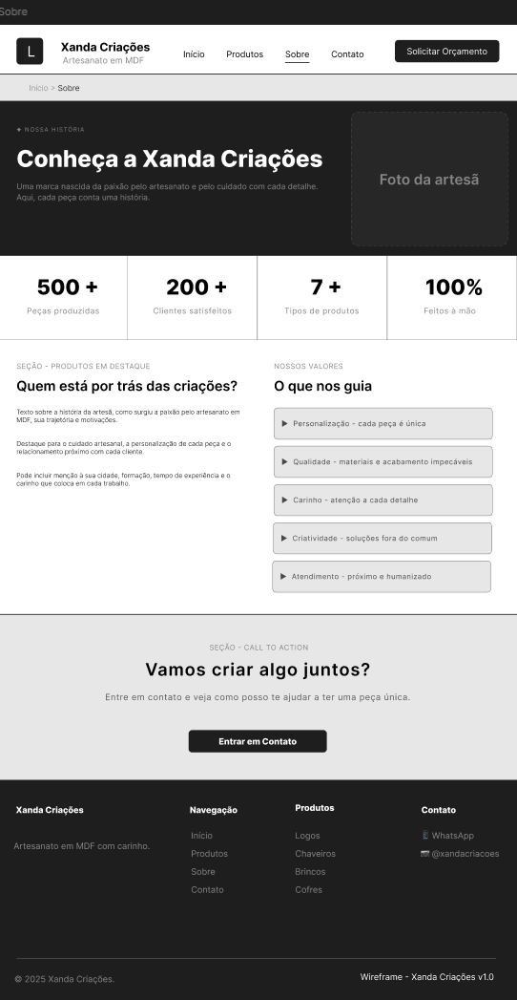

# 🪵 Xanda Criações — Site Institucional

> Site estático desenvolvido como projeto integrador extensionista universitário do curso de **Análise e Desenvolvimento de Sistemas** da **UNIVALI** (HOW V), em parceria com a empreendedora Priscila Alexandra da Silva Santos, fundadora da **Xanda Criações** — artesanato em MDF feito com carinho e criatividade.

---

## 📖 Sobre o Projeto

A **Xanda Criações** é um negócio artesanal fundado em 2024 por uma mãe empreendedora que transforma MDF em peças únicas e personalizadas: logos corporativos, chaveiros, brincos, cofres, porta-celulares, lembrancinhas e muito mais — utilizando cortadora a laser e impressora 3D.

Até o início deste projeto, a empresa tinha presença digital apenas no Instagram ([@xandacriacoes](https://instagram.com/xandacriacoes)), o que limitava seu alcance e visibilidade. O objetivo deste trabalho é **ampliar essa presença com um site profissional, acessível e de baixo custo operacional**, publicado de forma gratuita via Netlify.

Este projeto é parte da disciplina de **Hands on Work V (HOW V)**, onde alunos aplicam conhecimentos técnicos em benefício real da comunidade.

---

## 🎯 Objetivo

Desenvolver um site estático, responsivo e funcional para a Xanda Criações, permitindo que clientes encontrem os produtos, conheçam a história da marca e entrem em contato diretamente com a artesã — sem depender exclusivamente das redes sociais.

---

## 🗂️ Páginas do Site

| Página       | Descrição                                                                                                 |
| ------------ | --------------------------------------------------------------------------------------------------------- |
| **Início**   | Apresentação da marca, produtos em destaque, como funciona e call-to-action                               |
| **Produtos** | Catálogo completo: logos, chaveiros, brincos, cofres, porta-celular, lembrancinhas e peças personalizadas |
| **Sobre**    | História da artesã, valores da marca e números do negócio                                                 |
| **Contato**  | Formulário de orçamento, links para WhatsApp, Instagram e e-mail                                          |

---

## 🖼️ Protótipos (Wireframes)

Os wireframes foram desenvolvidos no **Figma** em nível médio de fidelidade, cobrindo as quatro páginas obrigatórias do projeto.

🔗 [Acesse o protótipo no Figma](https://www.figma.com/design/v06vUGvL1ZsTfaTW8o03pY/Wireframe---Xanda-Cria%C3%A7%C3%B5es?node-id=0-1&t=g56GhcQH9VPuyzt2-1)

### Página Inicial



### Página de Produtos



### Página de Contato



### Página Institucional (Sobre)



---

## 🛠️ Tecnologias Utilizadas

- **HTML5** — estrutura das páginas
- **CSS3** — estilização e responsividade
- **JavaScript** — interatividade
- **Bootstrap 5** — framework CSS para layout e componentes
- **Figma** — prototipação e wireframes
- **Netlify** — hospedagem estática gratuita
- **GitHub** — versionamento de código
- **Trello** — gestão de tarefas da equipe

---

## 🚀 Como Rodar Localmente

```bash
# Clone o repositório
git clone https://github.com/marcusteixeirabr/xandacriacoes.git

# Acesse a pasta
cd xandacriacoes

# Abra o arquivo index.html no seu navegador
# (não é necessário instalar nada — é tudo estático!)
```

> Ou simplesmente arraste o arquivo `index.html` para o navegador. 😄

---

## 📁 Estrutura de Pastas (planejada)

```
xandacriacoes/
├── index.html          # Página inicial
├── produtos.html       # Catálogo de produtos
├── sobre.html          # Página institucional
├── contato.html        # Página de contato
├── assets/
│   ├── css             # Estilos globais
│   │   ├── global.css  # Estilos globais
│   │   └── style.css   # Estilos páginas
│   ├── images/         # Fotos dos produtos e da artesã
│   │   ├── common/     # Imagens usadas em várias páginas (logo, ícones, etc.)
│   │   ├── home/       # Imagens da página inicial
│   │   ├── produtos/   # Imagens dos produtos
│   │   └── sobre/      # Imagens da página institucional
│   └── js/
│       ├── main.js     # Scripts gerais
│       ├── catalog.js  # Scripts do catálogo
│       └── form.js     # Scripts do formulário
└── docs/
    └── wireframe-*.png # Capturas dos protótipos do Figma
```

---

## 📋 Gestão do Projeto

O acompanhamento das tarefas é feito via **Trello**:

🔗 [Board do Projeto no Trello](https://trello.com/b/W3GMIOhZ)

---

## 👥 Equipe

| Nome                                 | GitHub / Contato                                                               |
| ------------------------------------ | ------------------------------------------------------------------------------ |
| Marcus Teixeira da Silva             | [@marcusteixeirabr](https://github.com/marcusteixeirabr)                       |
| Natasha Caroline da Silva Pereira    | [@natashapereira](https://github.com/natashapereira)                           |
| Carlos Martins Espinoza Filho        | [@carlosespinozagmc-bit](https://github.com/carlosespinozagmc-bit)             |
| Guilherme Bobany Tavares de Oliveira | [@guilhermebobanytavares-cmyk](https://github.com/guilhermebobanytavares-cmyk) |

> Projeto orientado pelo curso de ADS, Prof. Maurício Pasetto de Freitas, MSc — UNIVALI, Itajaí/SC.

---

## 🤝 Sobre a Parceira

**Priscila Alexandra da Silva Santos**

Fundadora da Xanda Criações

📱 WhatsApp: (47) 99268-0063

📧 xandacriacoes065782@gmail.com

📷 Instagram: [@xandacriacoes](https://instagram.com/xandacriacoes)

---

## 📄 Licença

Este projeto foi desenvolvido exclusivamente para fins acadêmicos e de extensão universitária. Todos os direitos sobre a marca **Xanda Criações** pertencem à sua proprietária.

---

<p align="center">
  Feito com 💙 por alunos de ADS — UNIVALI · HOW V · 2026
</p>
